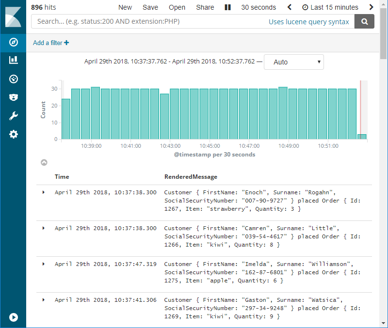

# Serilog and the Elastic Stack

## Table of contents

- [Introduction](#introduction)
- [What you will end up with](#what-you-will-end-up-with)
- [Requirements](#requirements)
- [Usage on Windows](#usage-on-windows)
- [Usage on Linux and macOS](#usage-on-linux-and-macos)
- [Credit](#credit)

---

## Introduction

[Elastic Stack](https://www.elastic.co/products) is fantastic at collecting and visualizing log events. [Serilog](https://serilog.net/) is fantastic at producing structured log events. This repository provides a sandbox where developers can explore the life of a log event starting with its birth in Serilog, its transport over the network to Logstash, its fields being indexed by Elasticsearch and finally its legacy being recorded as a historical event in Kibana.

## What you will end up with



With a running Elastic Stack and Serilog producing log events you are now ready to take it to the next level. If you fancy the producing part you'll dig deeper into Serilog and its configuration of log contexts, enrichers and message formatters. If you enjoy monitoring applications in production you'll explore Kibana with its visualizations and dashboards.

## Requirements

- [Docker](https://www.docker.com/community-edition#/download)

## Usage on Windows

### Bringing up Elastic Stack

Start the stack using `docker`:

```posh
cd .\elastic-stack\
docker compose up
```

If this is the first time the stack is started, you'll have to create a Logstash index pattern. Give the stack some time to initialize and then run the following commands in PowerShell:

```posh
$Headers = New-Object "System.Collections.Generic.Dictionary[[String],[String]]"
$Headers.Add("Content-Type", "application/json")
$Headers.Add("kbn-version", "7.17.0")
$Auth = [Convert]::ToBase64String([Text.Encoding]::ASCII.GetBytes("elastic:changeme"))
$Headers.Add("Authorization", "Basic {0}" -f $Auth)
Invoke-RestMethod "http://localhost:5601/api/saved_objects/index-pattern" `
  -Method Post `
  -Headers $Headers `
  -Body '{"attributes":{"title":"logstash-*","timeFieldName":"@timestamp"}}'
```

### Publishing log events using Serilog

Run the following commands to publish log events to Logstash using Serilog:

```posh
cd .\serilog\
docker compose up
```

If you decide to run the application outside of Docker in your terminal, don't forget to change the request URI to `http://localhost:31311`. More information can be found in `.\serilog\Program.cs`.

### Using Kibana to render the log events

Access the Kibana web UI by hitting [http://localhost:5601](http://localhost:5601) with a web browser, and when prompted enter username `elastic` and password `changeme`.

## Usage on Linux and macOS

### Bringing up Elastic Stack

Start the stack using `docker`:

```sh
cd elastic-stack/
docker compose up
```

If this is the first time the stack is started, you'll have to create a Logstash index pattern. Give the stack some time to initialize and then run the following commands:

```sh
curl -XPOST -D- 'http://localhost:5601/api/saved_objects/index-pattern' \
  -H 'Content-Type: application/json' \
  -H 'kbn-version: 7.17.0' \
  -u elastic:changeme \
  -d '{"attributes":{"title":"logstash-*","timeFieldName":"@timestamp"}}'
```

### Publishing log events using Serilog

Run the following commands to publish log events to Logstash using Serilog:

```sh
cd serilog/
docker compose up
```

If you decide to run the application outside of Docker in your terminal, don't forget to change the request URI to `http://localhost:31311`. More information can be found in `./serilog/Program.cs`.

### Using Kibana to render the log events

Access the Kibana web UI by hitting [http://localhost:5601](http://localhost:5601) with a web browser, and when prompted enter username `elastic` and password `changeme`.

## Credit

The `elastic-stack` directory is a clone of [docker-elk](https://github.com/deviantony/docker-elk) with minor modifications. Credit to [deviantony](https://github.com/deviantony) for publishing the Elastic Stack boilerplate.
